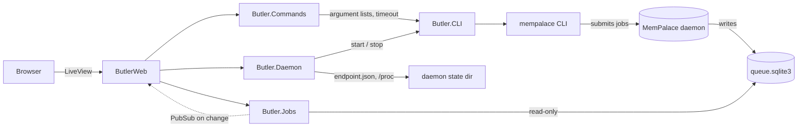

<h1 align="center">Butler</h1>

<p align="center"><strong>A local dashboard to monitor and control your MemPalace daemon</strong></p>

<p align="center">
  <a href="https://github.com/OWNER/butler/actions/workflows/ci.yml">
    
  </a>
  
</p>

---

The MemPalace daemon runs mining and MCP jobs in the background, and the only
way to follow them is to poll the CLI. Butler is a small, local Phoenix
LiveView app that shows the daemon status and its job queue live, lets you
submit `mine`, `sweep` and `sync` (dry-run) jobs, and runs the maintenance
commands that need the daemon stopped (`repair`, `compress`, `migrate-wings`)
safely.

Butler is read-only toward the daemon's data: it reads the job queue in
SQLite read-only and talks to the daemon exclusively through the `mempalace`
CLI. It never reads the daemon token and never calls its HTTP API.



The layers only depend downward: LiveViews render and delegate, `Butler.Commands`
validates and orchestrates, and anything that spawns a process goes through the
single `Butler.CLI` behaviour.

## Installation

Butler runs from source (there is no release package yet). You need
[mise](https://mise.jdx.dev), which installs Erlang/OTP 29 and Elixir 1.20,
and a working [MemPalace](https://github.com/MemPalace/mempalace) installation
with `mempalace` in your `PATH`. Linux only (daemon liveness uses `/proc`).

```bash
git clone https://github.com/OWNER/butler.git
cd butler
mise install        # Erlang 29 + Elixir 1.20.3-otp-29
mise run setup      # dependencies and assets
```

## Quickstart

Start Butler (it is a local tool, launched manually):

```bash
mise run server     # http://localhost:4000
```

Then open <http://localhost:4000>:

| Page | What you do there |
|---|---|
| **Daemon** | See whether the daemon runs, its PID, and job counters. Start, stop or restart it. |
| **Jobs** | Follow the queue live, filter by state or kind, open a job to read its payload, error and `mine` report. |
| **Launch** | Submit `mine`, `sweep` and `sync` (dry run only) jobs to the daemon. |
| **Maintenance** | Run `repair`, `compress` and `migrate-wings`: Butler stops the daemon, runs the command with live output, and restarts the daemon. |
| **Palace** | Placeholder for a future visualization. |

Butler watches the palace in `~/.config/mempalace/palace` by default; it can be
pointed elsewhere with the `BUTLER_PALACE_PATH` environment variable.

## Screenshots

All screenshots are taken in demo mode, on synthetic data (`mix butler.demo`: a
fake palace and a generated job queue; no `mempalace` command is ever run in
that mode). Butler also ships a dark theme, selectable with the toggle at the
bottom of the sidebar.

| Daemon | Jobs |
|---|---|
|  |  |

| Job detail | Launch |
|---|---|
|  |  |

| Maintenance |
|---|
|  |

## Documentation

| To... | Read |
|---|---|
| Install and try it | _Installation_, _Quickstart_ (coming soon) |
| Understand or change it | [CONTRIBUTING.md](CONTRIBUTING.md), [AGENTS.md](AGENTS.md) |

## Contributing

See [CONTRIBUTING.md](CONTRIBUTING.md).

## License

MIT — see [LICENSE](LICENSE).
