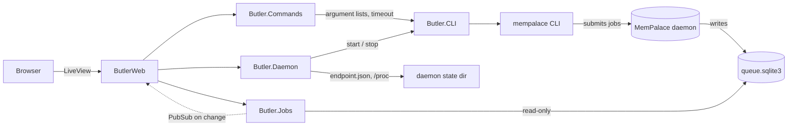

<h1 align="center">Butler</h1>

<strong>A local dashboard to monitor and control your MemPalace daemon</strong>

  
  

---

The MemPalace daemon runs mining and MCP jobs in the background, and the only
way to follow them is to poll the CLI. Butler is a small, local Phoenix
LiveView app that shows the daemon status and its job queue live, lets you
submit `mine`, `sweep` and `sync` (dry-run) jobs, and runs the maintenance
commands that need the daemon stopped (`repair`, `compress`, `migrate-wings`)
safely.

Butler is read-only toward the daemon's data: it reads the job queue in
SQLite read-only and talks to the daemon exclusively through the `mempalace`
CLI. It never reads the daemon token and never calls its HTTP API.

The layers only depend downward: LiveViews render and delegate, `Butler.Commands`
validates and orchestrates, and anything that spawns a process goes through the
single `Butler.CLI` behaviour.

## Installation

_Coming soon._

## Quickstart

_Coming soon._

## Documentation

| To... | Read |
|---|---|
| Install and try it | _Installation_, _Quickstart_ (coming soon) |
| Understand or change it | [CONTRIBUTING.md](CONTRIBUTING.md), [AGENTS.md](AGENTS.md) |

## Contributing

See [CONTRIBUTING.md](CONTRIBUTING.md).

## License

MIT — see [LICENSE](LICENSE).
