<h1 align="center">Butler</h1>

<p align="center"><strong>A local dashboard to monitor and control your MemPalace daemon</strong></p>

<p align="center">
  <a href="https://github.com/OWNER/butler/actions/workflows/ci.yml">
    
  </a>
  
</p>

---

The MemPalace daemon runs mining and MCP jobs in the background, and the only
way to follow them is to poll the CLI. Butler is a small, local Phoenix
LiveView app that shows the daemon status and its job queue live, lets you
submit `mine`, `sweep` and `sync` (dry-run) jobs, and runs the maintenance
commands that need the daemon stopped (`repair`, `compress`, `migrate-wings`)
safely.

Butler is read-only toward the daemon's data: it reads the job queue in
SQLite read-only and talks to the daemon exclusively through the `mempalace`
CLI. It never reads the daemon token and never calls its HTTP API.

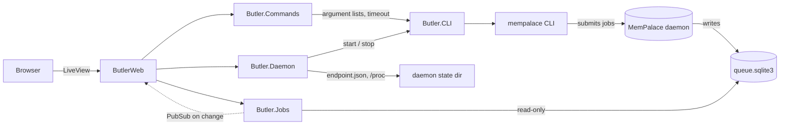

The layers only depend downward: LiveViews render and delegate, `Butler.Commands`
validates and orchestrates, and anything that spawns a process goes through the
single `Butler.CLI` behaviour.

## Installation

Butler runs from source (there is no release package yet). You need
[mise](https://mise.jdx.dev), which installs Erlang/OTP 29 and Elixir 1.20,
and a working [MemPalace](https://github.com/MemPalace/mempalace) installation
with `mempalace` in your `PATH`. Linux only (daemon liveness uses `/proc`).

```bash
git clone https://github.com/OWNER/butler.git
cd butler
mise install        # Erlang 29 + Elixir 1.20.3-otp-29
mise run setup      # dependencies and assets
```

## Quickstart

Start Butler (it is a local tool, launched manually):

```bash
mise run server     # http://localhost:4000
```

Then open <http://localhost:4000>:

| Page | What you do there |
|---|---|
| **Daemon** | See whether the daemon runs, its PID, and job counters. Start, stop or restart it. |
| **Jobs** | Follow the queue live, filter by state or kind, open a job to read its payload, error and `mine` report. |
| **Launch** | Submit `mine`, `sweep` and `sync` (dry run only) jobs to the daemon. |
| **Maintenance** | Run `repair`, `compress` and `migrate-wings`: Butler stops the daemon, runs the command with live output, and restarts the daemon. |
| **MCP** | See the state of the MCP proxy backends (`full`, `light`), the time before the next rotation, client sessions and requests; force a restart. |
| **Palace** | Placeholder for a future visualization. |

Butler watches the palace in `~/.config/mempalace/palace` by default; it can be
pointed elsewhere (see [Configuration](#configuration)).

No MemPalace at hand? `mix butler.demo` runs Butler on synthetic data; the
`mempalace` CLI is then replaced by a stub that executes nothing.

## Configuration

Butler monitors a single palace. It is configured with environment variables,
read at startup by `config/runtime.exs`:

| Variable | Default | Meaning |
|---|---|---|
| `BUTLER_PALACE_PATH` | `~/.config/mempalace/palace` | The palace to monitor and control. |
| `BUTLER_MEMPALACE_HOME` | `~/.mempalace` | MemPalace state home; daemon state lives in `<home>/daemon/<id>/`. |
| `MEMPALACE_DAEMON_STATE_ROOT` | `<home>/daemon` | Same variable as the daemon's own: overrides the daemon state root. Inherited by the CLI processes Butler starts. |
| `BUTLER_MEMPALACE_BIN` | `mempalace` | The `mempalace` executable (resolved through `PATH`). |
| `PORT` | `4000` | HTTP port. |
| `BUTLER_MCP_ENABLED` | `true` | `false` disables the MCP proxy. |
| `BUTLER_MCP_ROTATION_MINUTES` | `10` | Idle time after which a backend process is recycled. |
| `BUTLER_MCP_FULL_BIN` | `mempalace-mcp` | Executable of the `full` backend. |
| `BUTLER_MCP_LIGHT_BIN` | `mempalace-light-mcp` | Executable of the `light` backend. |

One application setting is not an environment variable:
`config :butler, :blocking_job_states, [:queued, :running]` lists the job
states that make Butler refuse direct maintenance commands.

## MCP proxy

Each agent session normally starts its own `mempalace-mcp` Python process, and
those processes keep their memory. Butler can serve **one shared pair of
processes per backend** over HTTP instead:

| Route | Backend |
|---|---|
| `POST http://localhost:4000/mcp/full` | `mempalace-mcp` (all tools) |
| `POST http://localhost:4000/mcp/light` | `mempalace-light-mcp` (`palace_query`, `palace_exec`, `palace_coordinate`) |

It speaks the MCP "Streamable HTTP" transport in its simplest form: one JSON
request, one JSON answer, an `Mcp-Session-Id` header managed by Butler, no
server-sent events (`GET` answers `405`, `DELETE` ends a session). It is a
transparent proxy: every tool of the backend is exposed, writes included. It
serves the palace Butler is configured for (`BUTLER_PALACE_PATH`).

Point an MCP client at it, for example with the HTTP transport of your agent:

```json
{ "mcpServers": { "mempalace": { "type": "http", "url": "http://localhost:4000/mcp/light" } } }
```

How it works:

- Each backend keeps **two** processes: an active one and a warm standby.
- After 10 idle minutes (configurable) the standby takes over, the old process
  is killed (its memory goes back to the system) and a new standby starts. This
  happens even when nobody uses the proxy.
- If the active process crashes, the requests in flight get an error right
  away (nothing is retried, so a write is never executed twice) and the standby
  takes over.
- If a backend cannot start (missing binary, palace error) after 3 attempts in
  a row, it is marked **failed** on the MCP page; **Restart** tries again.
- Sessions belong to Butler, not to a process: rotations and crashes do not
  invalidate them.

The routes accept loopback connections only and check the `Host` and `Origin`
headers (against DNS rebinding and web pages aiming at `localhost`). There is
**no authentication**: anything running on your machine can use them. The
processes' stderr goes to Butler's logs.

## Safety rules

Butler is built to be harmless to your palace. These rules are enforced by the
code and covered by tests:

- It **never reads the daemon `token` file** and **never calls the daemon HTTP
  API**. Everything goes through the `mempalace` CLI.
- The job queue (`queue.sqlite3`) is opened **read-only**; Butler cannot modify it.
- Every CLI call uses an **argument list** (never a shell string) and a
  **timeout**; on timeout the process is killed by its OS pid. The only
  long-lived processes are the MCP proxy backends, started the same way and
  killed by OS pid.
- The MCP proxy **serves** HTTP on loopback but Butler still has no HTTP
  client.
- `sync` is **always a dry run**: `sync --apply` is not exposed and cannot be built.
- Values are validated before reaching the CLI (absolute existing paths,
  whitelisted modes, positive integers, nothing that looks like an option).
- `repair`, `compress` and `migrate-wings` are **refused while jobs are queued
  or running**; Butler stops the daemon, waits until it is really stopped,
  re-checks the queue, runs the command, and restarts the daemon even if the
  command fails or times out. Only one such run can happen at a time.
- Tests use mocks and fixture databases with **synthetic data** only.

### Things to know

- **Stopping the daemon** waits up to 10 seconds for the running job to finish.
  If it is still running, the daemon marks it `cancelled`; it is **not**
  resumed automatically when the daemon starts again. Queued jobs stay queued.
- `mempalace ... --daemon` (used by the Launch page) **starts the daemon** if it
  is not running.
- The CLI does not deduplicate the jobs it submits, so Butler refuses to submit
  a job identical to a queued or running one (best effort).
- Daemon liveness uses `/proc`: **Linux only**.
- Out of scope for now: palace visualization, live job progress (the daemon
  only writes a job's result when it ends), cancelling or retrying a job,
  `sync --apply`, remote access or authentication, several palaces, streaming
  (SSE) and batches in the MCP proxy.

## Screenshots

All screenshots are taken in demo mode, on synthetic data (`mix butler.demo`: a
fake palace and a generated job queue; no `mempalace` command is ever run in
that mode). Butler follows the system theme by default; the toggle at the
bottom of the sidebar switches between system, light and dark. Each page is
shown in both themes.

| Daemon (light) | Daemon (dark) |
|---|---|
| 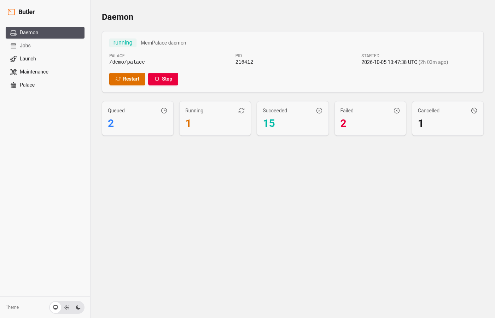 | 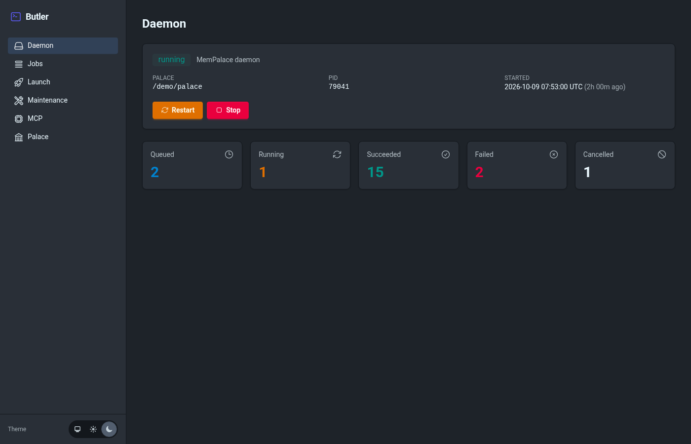 |

| Jobs (light) | Jobs (dark) |
|---|---|
| 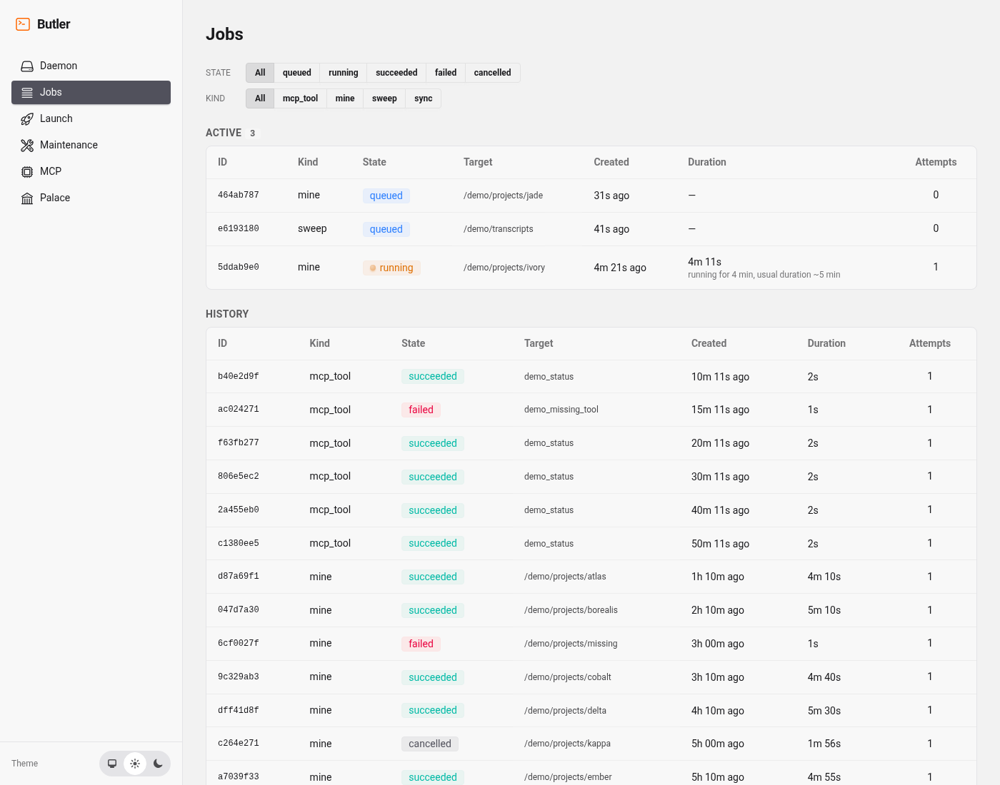 | 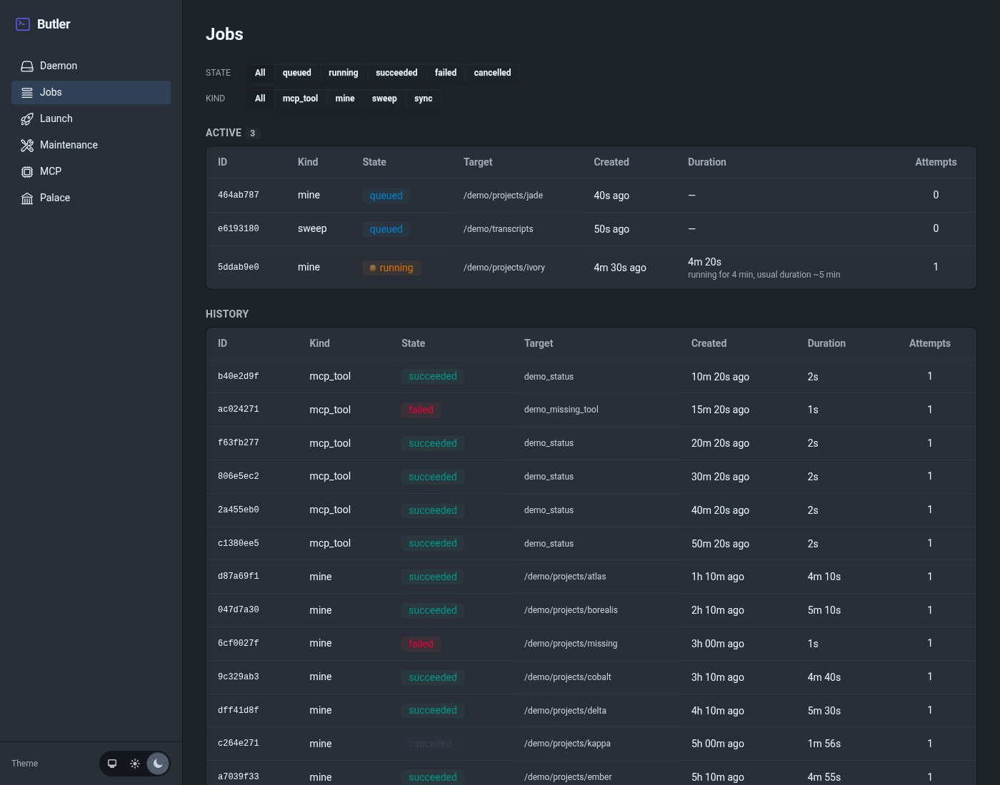 |

| Job detail (light) | Job detail (dark) |
|---|---|
| 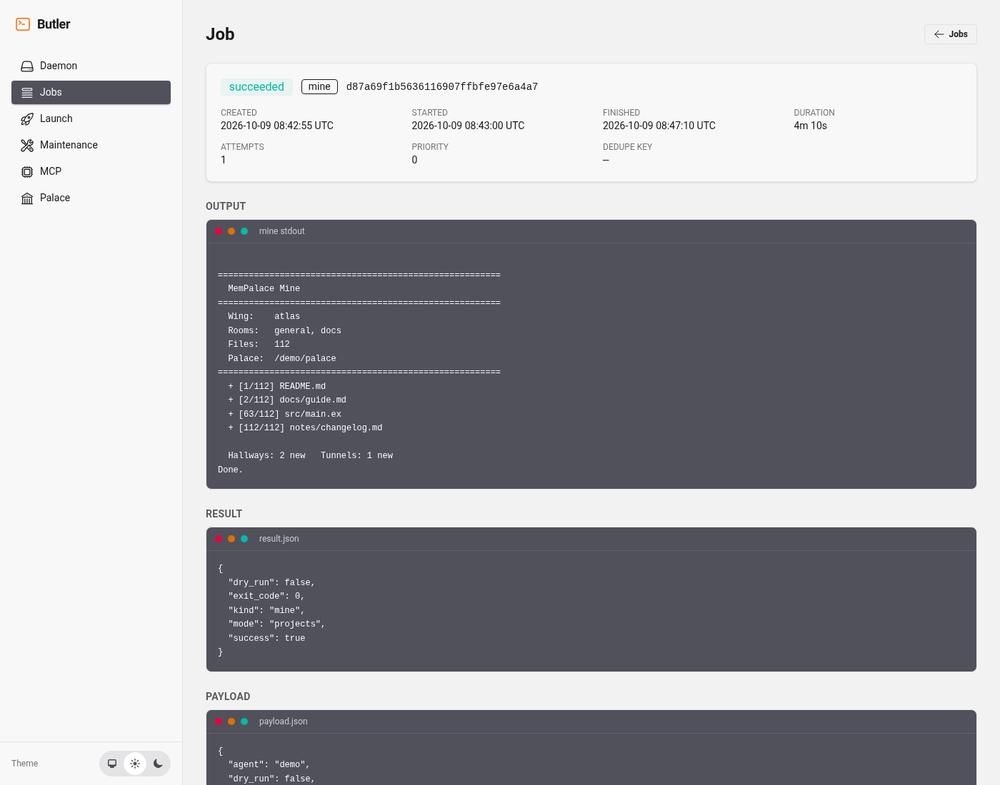 | 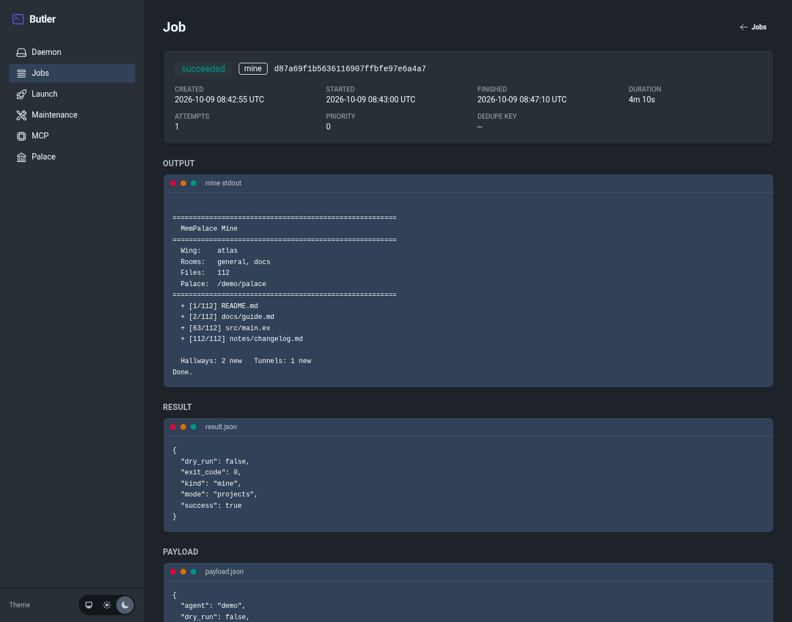 |

| Launch (light) | Launch (dark) |
|---|---|
| 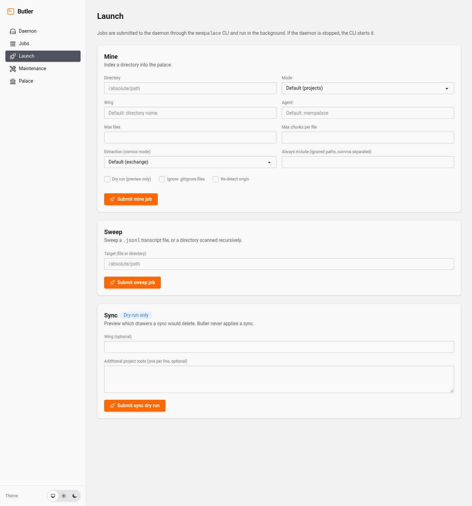 | 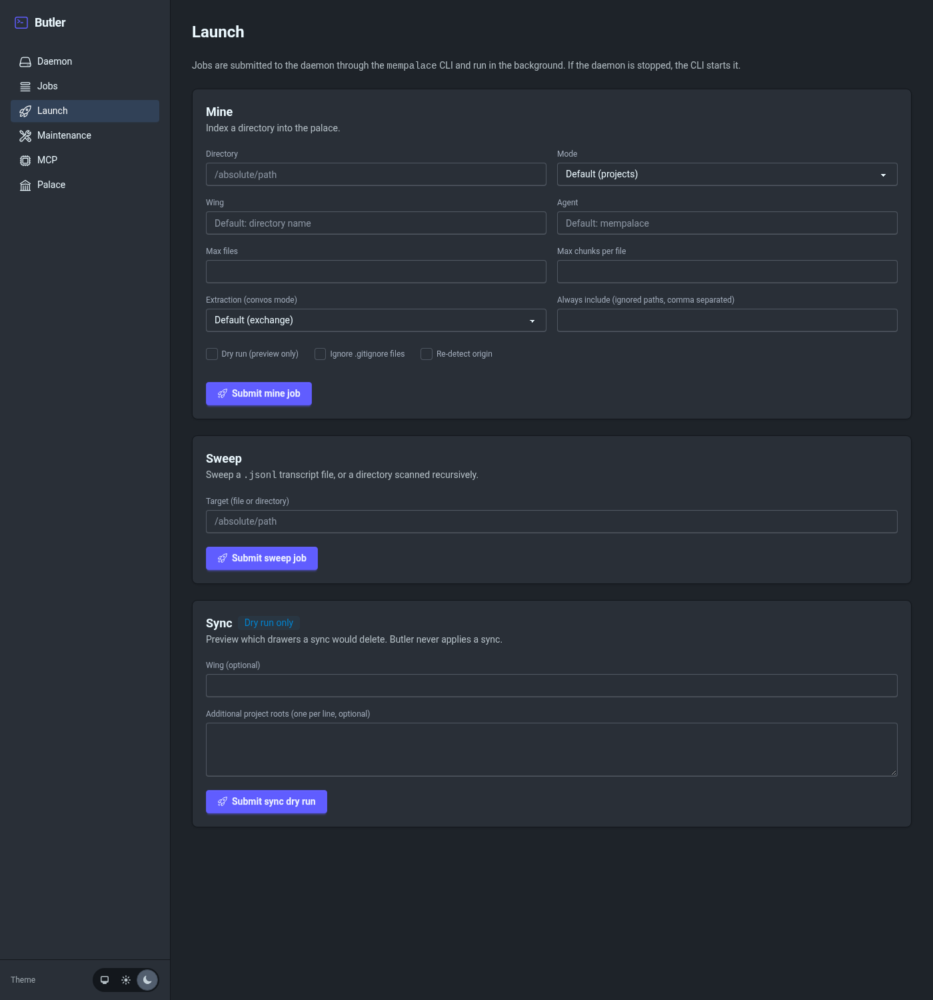 |

| Maintenance (light) | Maintenance (dark) |
|---|---|
| 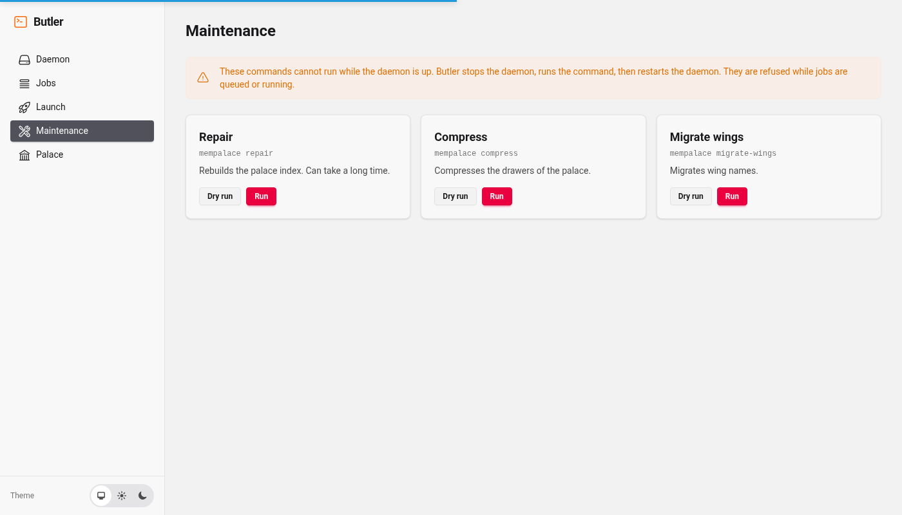 | 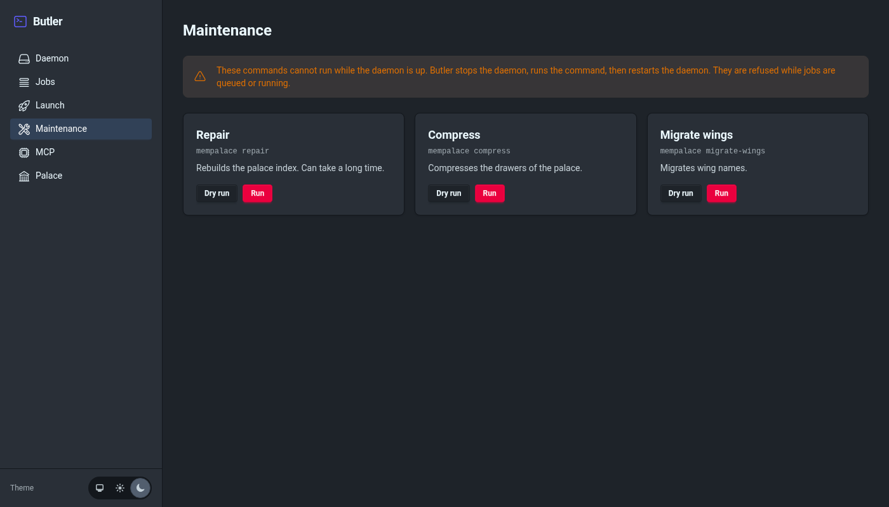 |

| MCP (light) | MCP (dark) |
|---|---|
| 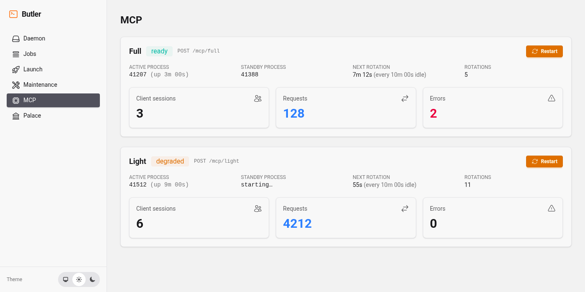 | 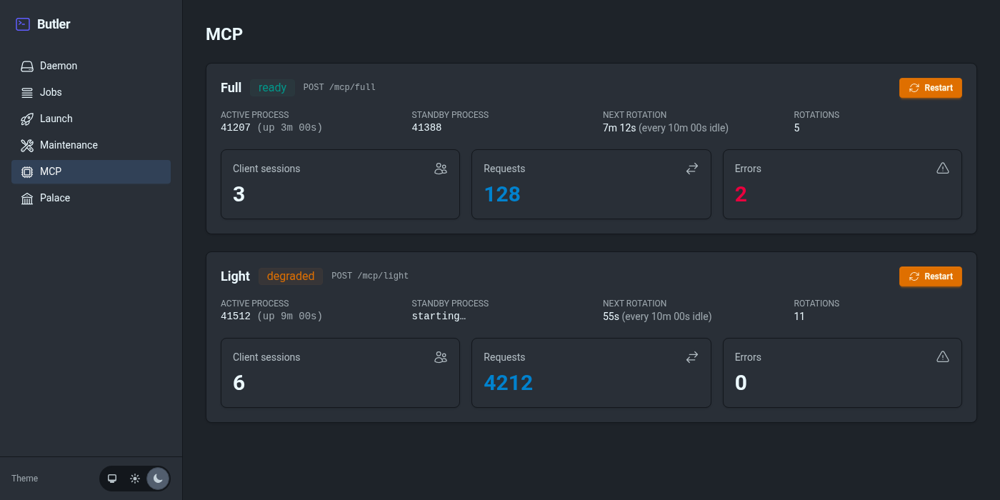 |

## Documentation

| To... | Read |
|---|---|
| Install and try it | [Installation](#installation), [Quickstart](#quickstart), [Screenshots](#screenshots) |
| Configure it | [Configuration](#configuration) |
| Trust it | [Safety rules](#safety-rules) |
| Understand or change it | [CONTRIBUTING.md](CONTRIBUTING.md), [AGENTS.md](AGENTS.md) |

## Contributing

See [CONTRIBUTING.md](CONTRIBUTING.md).

## License

MIT — see [LICENSE](LICENSE).
